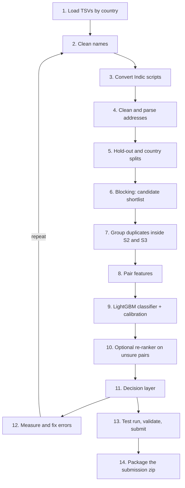

# Entity Resolution Pipeline — Environment & Design Spec

Sep 26, 2026 · @Moksh

Master copy (editable): https://claude.ai/code/artifact/473eeb77-30f5-48c5-9b6e-6563c89c9d10

## 1. Overview

This spec fixes every version, tool and model before any pipeline code is written. It also defines exactly how each stage of the Business Entity Resolution pipeline works. Every entry was checked against PyPI and Hugging Face on 2026-09-26.

**The task.** Source 1 is a clean, deduplicated list of businesses. Sources 2 and 3 are noisy lists; they contain duplicates and look-alike decoys. For every Source 1 record, output the Source 2/3 records that are the same real business, or an empty list.

**Scale.**

| Split | Source 1 | Source 2 | Source 3 | Countries |
| --- | --- | --- | --- | --- |
| Train | 2,206,821 | 5,034,616 | 5,285,603 | US 60%, India 40% |
| Test | 1,732,544 | 4,887,273 | 5,082,316 | India 47%, US 38%, France 15% |

**Rules that constrain tooling** (from the problem statement, Constraints #5 and Fair Play):

- The final model must be licensed **MIT or Apache-2.0** and have **at most 8B parameters**.
- **No external lookups**: no entity-resolution APIs, business registries, geocoding, or internet data augmentation. Breaking this means disqualification.
- The submission zip must reproduce both output files from the data, using only its own `code/` folder with a pinned `requirements.txt`.
- Every leaderboard upload must pass `utils/validate_submission.py`. Teams get 5 submissions per day, and the window closes 2026-09-27 at 23:59 IST.

**Scoring.** F0.5 is computed for each Source 1 record, then averaged over all Source 1 records. A wrong link costs about twice as much as a missed one. A record with no true match scores 1.0 only if its prediction is empty. The public leaderboard leader stood at 0.9907 when this spec was written.

**Scope.** This spec covers the environment, dependencies, license compliance and the detailed pipeline design. The code is written only after this spec is agreed.

### Decisions agreed by the team on 2026-09-26

| Topic | Decision |
| --- | --- |
| Team | Barely Legal: Raghav Dokania, Moksh Chugh, Utkarsh Goel, Daksh Sajwan. All four decide together; work runs on one laptop. |
| Submission budget | 0 of 5 used on 2026-09-26, so up to 10 remain (5 today, 5 on 2026-09-27) |
| Re-ranker (step 10) | Optional. Considered only after v1 is built and benchmarked. |
| Reference Python | 3.14.3 |
| Code and outputs | Project root: `code/business_entity_resolution/` and `output/` |
| Large files | Outside OneDrive: venv at `C:\Users\utkar\venvs\amazon-er`; caches and model files at `C:\Users\utkar\er_work\cache` and `C:\Users\utkar\er_work\models`; submitted files archived in `C:\Users\utkar\er_work\submissions` |
| Version control | Local git repository in the project root, no remote; one git tag per leaderboard submission |
| Methodology write-up | About 2 pages of core template sections, plus an appendix |
| Zip name | `Barely_Legal_submission.zip` |

## 2. Runtime environment and version pins

The pipeline runs on **Python 3.14.3** in a dedicated venv at `C:\Users\utkar\venvs\amazon-er`. The venv lives outside OneDrive so thousands of small files aren't synced. The 52 packages below were resolved together by `pip install --dry-run --ignore-installed --report` with no conflicts, and every one has a ready-made Windows wheel for Python 3.14, so nothing is compiled.

### 2.1 Machine

| Item | Value |
| --- | --- |
| OS | Windows 11 Home 10.0.26200 |
| CPU | 16 logical cores |
| RAM | 23.7 GB |
| GPU | NVIDIA RTX 4050 Laptop, 6 GB, driver 596.36 |
| Python | 3.14.3 (3.11 also installed as a fallback) |
| pip | 26.0.1 |

### 2.2 Core lock: `requirements.txt` (29 packages, always installed)

| Package | Pin | Direct or transitive | Used for |
| --- | --- | --- | --- |
| numpy | 2.4.6 | direct | arrays and numeric features |
| pandas | 3.0.1 | direct | loading and joining tables |
| pyarrow | 23.0.1 | direct | Arrow string columns, parquet cache |
| scipy | 1.16.3 | direct | sparse matrices for TF-IDF |
| scikit-learn | 1.8.0 | direct | TF-IDF vectorizer, isotonic calibration, data splits |
| joblib | 1.5.3 | direct | multiprocess feature computation |
| lightgbm | 4.7.0 | direct | pair classifier (the final model) |
| RapidFuzz | 3.14.6 | direct | string similarity scores |
| sparse-dot-topn | 1.2.0 | direct | fast top-N sparse similarity search for blocking |
| indic\_transliteration | 2.3.82 | direct | fallback Indic-script → Latin conversion |
| tqdm | 4.67.1 | direct | progress bars |
| narwhals | 2.26.0 | transitive | dataframe compatibility layer |
| python-dateutil | 2.9.0.post0 | transitive | pandas dependency |
| six | 1.17.0 | transitive | python-dateutil dependency |
| tzdata | 2026.4 | transitive | pandas time zones |
| threadpoolctl | 3.7.0 | transitive | scikit-learn thread control |
| psutil | 7.2.2 | transitive | lightgbm and joblib system info |
| colorama | 0.4.6 | transitive | tqdm colours on Windows |
| regex | 2026.9.10 | transitive | indic\_transliteration |
| roman | 5.2 | transitive | indic\_transliteration |
| toml | 0.10.2 | transitive | indic\_transliteration |
| typer | 0.27.2 | transitive | indic\_transliteration CLI |
| annotated-doc | 0.0.5 | transitive | typer |
| rich | 15.0.0 | transitive | typer |
| Pygments | 2.21.0 | transitive | rich |
| markdown-it-py | 4.2.0 | transitive | rich |
| mdurl | 0.1.2 | transitive | markdown-it-py |
| shellingham | 1.5.4 | transitive | typer |
| backports.functools-lru-cache | 2.0.0 | transitive | indic\_transliteration |

**numpy is pinned to 2.4.6, not the installed 2.4.0**, because 2.4.0 was yanked upstream for a backward-compatibility bug.

### 2.3 Optional re-ranker lock: `requirements-rerank.txt` (23 more packages)

Install this only if the transformer re-ranker or embedding blocking is used. Torch comes from the PyTorch CUDA 12.8 index; a `torch 2.9.1+cu128` wheel for Python 3.14 on Windows was confirmed to exist.

| Package | Pin | Direct or transitive | Used for |
| --- | --- | --- | --- |
| torch | 2.9.1+cu128 | direct | GPU inference and fine-tuning |
| transformers | 4.57.3 | direct | model loading and tokenization |
| sentence-transformers | 5.2.0 | direct | embedding and cross-encoder training |
| faiss-cpu | 1.15.1 | direct | approximate nearest-neighbour search |
| huggingface\_hub | 0.36.2 | direct | one-time model download at a pinned revision |
| tokenizers | 0.22.2 | transitive | fast tokenizers |
| safetensors | 0.8.0 | transitive | safe weight loading |
| fsspec | 2026.9.0 | transitive | file-system layer |
| networkx | 3.7 | transitive | torch |
| sympy | 1.14.0 | transitive | torch |
| mpmath | 1.3.0 | transitive | sympy |
| filelock | 4.0.3 | transitive | model cache locking |
| Jinja2 | 3.1.6 | transitive | torch and transformers templates |
| MarkupSafe | 3.0.3 | transitive | Jinja2 |
| packaging | 26.3 | transitive | version parsing |
| PyYAML | 6.0.3 | transitive | config files |
| requests | 2.34.2 | transitive | one-time model download only |
| charset-normalizer | 3.5.1 | transitive | requests |
| idna | 3.20 | transitive | requests |
| urllib3 | 2.8.0 | transitive | requests |
| certifi | 2026.7.22 | transitive | requests TLS certificates |
| typing\_extensions | 4.16.0 | transitive | typing backports |
| setuptools | 84.0.0 | transitive | torch |

### 2.4 Install commands

```
py -3.14 -m venv C:\Users\utkar\venvs\amazon-er
C:\Users\utkar\venvs\amazon-er\Scripts\activate
python -m pip install --upgrade pip
python -m pip install -r code/business_entity_resolution/requirements.txt
# optional, only if the re-ranker is enabled
python -m pip install -r code/business_entity_resolution/requirements-rerank.txt
python -m pip check
```

Hash-pinned variants (`requirements.lock.txt` with `--require-hashes`) are generated from the same dry-run report, so a reviewer gets byte-identical wheels.

### 2.5 Test lock: `requirements-dev.txt` (development only)

The tests use pytest. It is not needed to reproduce the outputs, so it has its own file. The versions were resolved and license-checked on 2026-09-26; Pygments, colorama and packaging are already pinned in the other two files.

| Package | Pin | License |
| --- | --- | --- |
| pytest | 9.1.1 | MIT |
| pluggy | 1.6.0 | MIT |
| iniconfig | 2.3.0 | MIT |
| packaging | 26.3 | Apache-2.0 or BSD-2 |

Install with `python -m pip install -r code/business_entity_resolution/requirements-dev.txt`.

## 3. External tools and models

The pipeline uses one trained model of our own (LightGBM) and, optionally, one small pretrained multilingual model. Both are licensed MIT and far below 8B parameters. Every other external tool is an offline library; nothing calls a network service while the pipeline runs.

### 3.1 Models

| Role | Model | Pinned revision (commit SHA) | License | Parameters | Status |
| --- | --- | --- | --- | --- | --- |
| **Final pair classifier** | LightGBM gradient-boosted trees, trained by us only on the provided training data | our code version (git tag per submission) | library MIT; our code MIT | about 1–10M tree nodes, far below 8B | required |
| Embedding blocking and cross-encoder re-ranker base | [intfloat/multilingual-e5-small](https://huggingface.co/intfloat/multilingual-e5-small) | 614241f622f53c4eeff9890bdc4f31cfecc418b3 | MIT | 117,654,272 | optional, primary |
| Backup embedder | [sentence-transformers/paraphrase-multilingual-MiniLM-L12-v2](https://huggingface.co/sentence-transformers/paraphrase-multilingual-MiniLM-L12-v2) | e8f8c211226b894fcb81acc59f3b34ba3efd5f42 | Apache-2.0 | 117,654,272 | optional, backup |
| Heavier backup (slow on a 6 GB GPU) | [sentence-transformers/LaBSE](https://huggingface.co/sentence-transformers/LaBSE) | 836121a0533e5664b21c7aacc5d22951f2b8b25b | Apache-2.0 | 470,927,360 | optional, last resort |

Models are loaded only by `revision=<sha>`. They are downloaded once into `C:\Users\utkar\er_work\models` and then run with `HF_HUB_OFFLINE=1` and `TRANSFORMERS_OFFLINE=1`. The same details are recorded in `models.lock.json`.

### 3.2 External tools by job

| Job | Tool | Why this one |
| --- | --- | --- |
| Read the 1.5 GB TSVs and cache them as parquet | pandas + pyarrow | Arrow string columns cut memory about 3×, so 12M rows fit in 24 GB |
| Clean text: accents, punctuation, unicode | Python stdlib `unicodedata` and `re` | no dependency; replaces the GPL-licensed `unidecode` |
| Convert Indic scripts to Latin (fallback only) | indic\_transliteration | MIT; character-mapping tables only, no business data |
| Build character 3-gram TF-IDF vectors | scikit-learn `TfidfVectorizer` | standard, sparse, fast |
| Find the top-N most similar records | sparse-dot-topn | multithreaded top-N sparse matrix product; avoids building a 1.7M × 5M dense matrix |
| Embedding nearest-neighbour search (optional) | faiss-cpu | MIT; replaces hnswlib, which has no Windows wheel |
| String similarity features | RapidFuzz | MIT, C++ speed; replaces the GPL-licensed `python-Levenshtein` and `fuzzywuzzy` |
| Parallel feature computation | joblib | spreads work across 16 cores |
| Pair classifier | LightGBM | trains in minutes on 10–15M rows; handles mixed numeric features |
| Probability calibration | scikit-learn `IsotonicRegression` | turns scores into true probabilities for the F0.5 decision step |
| Optional re-ranker | torch + transformers + sentence-transformers | fine-tunes the pinned e5-small on pairs the classifier is unsure about |
| Format check before upload | organisers' `utils/validate_submission.py` | stdlib only; catches rejections locally |

### 3.3 Data we build ourselves (no external data)

- **Indic ↔ Latin token table.** Learned from training pairs where a Hindi, Odia, Kannada, Tamil or other Indic-script name is labelled as the same business as a Latin name, for example प्राइवेट → private.
- **Abbreviation and state dictionaries.** Hand-written domain knowledge: St/Street, Rd/Road, R./Rue, Bd/Boulevard; US state codes; Indian states and their native-script names; French régions and départements. These count as normalization rules, not data lookups.
- **IDF weights and name-frequency counts.** Computed only from the provided source files.

## 4. License and compliance verification

All 52 pinned packages and all 3 optional models are under permissive licenses, and none is GPL, AGPL or LGPL. The final model (LightGBM, MIT) and the optional model (multilingual-e5-small, MIT) both meet Constraint #5.

### 4.1 How it was verified

1. **Resolved the full tree.** `pip install --dry-run --ignore-installed --report` listed every package, direct and transitive, with exact versions and wheel file names.
2. **Read license metadata.** For each package, the check read the `License-Expression` field, the `License` field and the trove classifiers from the resolved metadata. It cross-checked those against the PyPI JSON API.
3. **Checked model licenses and sizes.** The Hugging Face model API gave each model's `license:` tag, its commit SHA and its exact parameter count from the safetensors index.
4. **Checked installability.** It confirmed a Windows wheel for Python 3.14 (`cp314`, `abi3` or `py3-none`) exists for every pin, including the CUDA build of torch.
5. **Hunted for traps.** It looked up the licenses of popular alternatives the pipeline might otherwise reach for, and banned the ones that fail.

### 4.2 Results by license family

| License family | Packages |
| --- | --- |
| MIT | lightgbm, RapidFuzz, indic\_transliteration, faiss-cpu, narwhals, six, toml, typer, annotated-doc, rich, markdown-it-py, mdurl, PyYAML, filelock, charset-normalizer, urllib3, setuptools, backports.functools-lru-cache |
| Apache-2.0 | pyarrow, sparse-dot-topn, transformers, sentence-transformers, huggingface\_hub, tokenizers, safetensors, requests, tzdata |
| BSD-2 or BSD-3 | numpy (plus 0BSD, MIT, Zlib and CC0 parts), pandas, scipy, scikit-learn, joblib, threadpoolctl, psutil, torch, networkx, sympy, mpmath, fsspec, idna, Jinja2, MarkupSafe, Pygments, colorama |
| Dual permissive | python-dateutil (BSD or Apache-2.0), packaging (Apache-2.0 or BSD-2) |
| Other permissive | shellingham (ISC), typing\_extensions (PSF-2.0), regex (Apache-2.0 and CNRI-Python), roman (ZPL-2.1) |
| Weak file-level copyleft, used unmodified | tqdm (MPL-2.0 and MIT), certifi (MPL-2.0) |

MPL-2.0 only obliges you to share changes to the MPL files themselves. We ship these packages unmodified, so it adds no obligation.

### 4.3 Banned packages

| Package | License or problem | Replacement |
| --- | --- | --- |
| unidecode | GPL-2.0-or-later | stdlib `unicodedata` NFKD folding |
| python-Levenshtein, Levenshtein | GPL-2.0-or-later | RapidFuzz `Levenshtein` module (MIT) |
| fuzzywuzzy | GPL lineage | RapidFuzz `fuzz` module |
| hnswlib | no Windows wheel, empty license metadata | faiss-cpu (MIT) |
| Any hosted LLM, geocoder, registry or entity-resolution API | Fair Play violation | none; everything runs offline |

### 4.4 How the rules are read

- **Constraint #5 governs the model.** The final model is our LightGBM (MIT library, our code MIT), and the optional model is e5-small (MIT). Supporting libraries are BSD, MIT or Apache, the same family the organisers' own starter snippet uses (pandas, BSD-3).
- **Fair Play.** Pretrained model weights are allowed by Constraint #5. They are downloaded once, before the pipeline runs. No business identity, address or registry data is fetched, and transliteration and abbreviation tables contain no business records.
- **Our own code** is released under MIT (a `LICENSE` file in `code/business_entity_resolution/`). `THIRD_PARTY_LICENSES.md` lists every package and model with its license for the reviewers.

## 5. Pipeline overview

The pipeline is retrieve, then rank, then decide. A cheap search narrows about 10M possible records to about 30 candidates per Source 1 record. A LightGBM classifier scores each pair. A decision layer tuned for F0.5 turns those scores into the final match lists.



The loop from step 12 back to step 2 is where most of the score is gained: each round fixes the largest remaining group of mistakes.

### Stage-to-tool map

| Step | Stage | Tools | Output |
| --- | --- | --- | --- |
| 1 | Load | pandas, pyarrow | `er_work\cache\{split}_{source}_{country}.parquet` |
| 2–4 | Normalize | stdlib `re` and `unicodedata`, learned token table, indic\_transliteration | cleaned name, legal suffix, address parts |
| 5 | Split | scikit-learn | holdout Source 1 IDs, country-transfer split |
| 6 | Blocking | scikit-learn TF-IDF, scipy, sparse-dot-topn, optional faiss-cpu + e5-small | `candidate_pairs.tsv` |
| 7 | Sibling groups | pandas, numpy | group ID per Source 2/3 record |
| 8 | Features | RapidFuzz, numpy, joblib | about 40 features per pair |
| 9 | Classifier | lightgbm, scikit-learn isotonic | calibrated match probability per pair |
| 10 | Re-ranker (optional) | torch, sentence-transformers, e5-small | refined probabilities for the unsure band |
| 11 | Decide | numpy, pandas | `matching_results.tsv` |
| 12 | Evaluate | our `evaluate.py` | macro F0.5 by country, error report |
| 13 | Validate | `utils/validate_submission.py` | PASS or a list of issues |
| 14 | Package | stdlib `zipfile` | `<team>_submission.zip` |

### Planned code layout

```
code/business_entity_resolution/
  src/
    config.py         # all paths (data, er_work cache/models/submissions) and seeds
    check_env.py      # version + license gate (runs first)
    smoke_test.py     # seconds-long checks of every pinned tool
    io_utils.py       # step 1
    normalize.py      # steps 2-4
    splits.py         # step 5
    blocking.py       # step 6
    siblings.py       # step 7
    features.py       # step 8
    train.py          # step 9
    rerank.py         # step 10 (optional, after v1 benchmark)
    decide.py         # step 11
    evaluate.py       # step 12
    run_all.py        # entry point: data -> both output files
  tests/              # pytest unit and integration tests (section 9.6)
  requirements.txt
  requirements-rerank.txt
  requirements-dev.txt
  models.lock.json
  THIRD_PARTY_LICENSES.md
  LICENSE
  README.md
```

## 6. Detailed pipeline, step by step

Each step lists its input, what it does, its output and why it exists. One real training cluster runs through as the example:

```
S1  Porter & Nall        | 3220 Gale Street, Indianapolis, IN
S2  PORTER & NALL [LLC]  | (empty)                                  true match
S2  porternall.com       | 3220 GALE SAINT, INDIANAPOLIS, IN        true match
S3  Porter & Ngial       | 3220. Gale St, Indianapolis, Indiana     true match (typo)
S3  Porter & Nall        | 3220. Gale Street, Indianapolis, Indiana true match
```

Facts measured on the training data that shape the design:

- Each Source 2/3 record belongs to at most one Source 1 record.
- About 26% of Source 2/3 records match nothing. They are decoys: the same name with a nearby house number, or the same name in another city.
- No match ever crosses countries.
- Source 1 is always in Latin script. 9.4% of Source 2 names and 5.3% of Source 3 names use an Indic script.
- 205k groups of Source 1 records share an identical cleaned name, so the name alone cannot decide a match.
- Among pairs with identical cleaned names, a shared house number appears in 75% of true matches but only 3.2% of decoys.

### Step 1: Load the data

- **Input:** the 7 TSV files (about 2.5 GB).
- **Process:**
  - Read with `sep="\t"`, `encoding="utf-8"`, `dtype="string[pyarrow]"`, `quoting=csv.QUOTE_NONE` and `keep_default_na=False`, so literal `null` text stays text.
  - Derive the source from the ID prefix and keep `country` as an open set of labels (US, India, France and anything else).
  - Parse the ground truth into a long table of `(s1_id, s23_id)` pairs.
  - Write one parquet file per split, source and country.
- **Output:** `er_work\cache\*.parquet` and `er_work\cache\gt_pairs.parquet` (7.64M positive pairs).
- **Why:** later steps reload in seconds instead of re-parsing text, and working one country at a time keeps memory under 24 GB.

### Step 2: Clean the business names

- **Input:** raw `business_name`.
- **Process, in this order:**
  1. Unicode NFKC, then NFKD with combining accents removed (sígnature → signature, Àmicale → amicale), then lowercase.
  2. Strip junk tokens: `<<`, `--`, `##`, `[ ]`, `( )`, `<NULL>`, `null`.
  3. Strip domains and handles: `porternall.com` → `porternall`, `@wheelmanagement` → `wheelmanagement`. Split the glued word later with a vocabulary learned from Source 1 names.
  4. Fix digits used as letters inside words: 1 → l, 0 → o, 3 → e, only when the token has letters on both sides (Go1den → golden).
  5. Split "doing business as" or "dba" names into two names and keep both.
  6. Turn `&` into `and`.
  7. Pull legal suffixes into a separate `legal` field: inc, llc, corp, corporation, co, company, ltd, limited, pvt, private, llp, lp, plc, sarl, sas, sasu, eurl, sa, sci, cie, gmbh, groupe.
  8. Remove honorifics: m/s, smt, shri, sri, the.
  9. Build three forms: `name_clean` (word order kept), `name_sorted` (words sorted) and `name_key` (letters only, no spaces).
- **Output:** `name_clean`, `name_sorted`, `name_key`, `legal`, `alt_name` (from dba).
- **Example:** `PORTER & NALL [LLC]` → clean `porter and nall`, legal `llc`.
- **Why:** after cleaning, most same-business names become nearly identical, so similarity scores become sharp.

### Step 3: Convert Indic scripts to Latin

- **Input:** names and addresses that contain Devanagari, Bengali, Odia, Kannada, Tamil, Telugu, Gujarati, Gurmukhi or Malayalam characters.
- **Process:**
  1. **Learn a token table from training.** For each training pair where the Source 2/3 name is in an Indic script and the Source 1 name is in Latin script, align tokens by position after removing legal words. Count the co-occurrences and keep a mapping when it wins at least 80% of cases with at least 5 occurrences (for example क्रिएटिव → creative, प्राइवेट → private, लिमिटेड → limited).
  2. **Fallback** for unmapped tokens: rule-based transliteration with indic\_transliteration (ITRANS), then a phonetic squash (drop vowels after the first letter, fold aa/a, ee/i, sh/s).
  3. **Handle mixed-script names** such as `Digital सिस्टम्स` token by token.
  4. **Map native-script state names** (महाराष्ट्र, ଓଡ଼ିଶା, ಕರ್ನಾಟಕ) to canonical state codes with a hand dictionary.
- **Output:** a Latin `name_clean` for every record, plus a flag `was_indic`.
- **Why:** without this step, about 5–10% of true matches share zero letters with their Source 1 record and are unreachable.

### Step 4: Clean and parse the addresses

- **Input:** raw `business_address`.
- **Process:**
  1. Apply the same unicode, lowercase and junk cleaning as step 2, and also drop `<null>`, `null` and `#`.
  2. Expand abbreviations to one canonical word: st, saint, str → street; rd → road; ave, av → avenue; dr → drive; ct → court; ln → lane; blvd, bd → boulevard; r, r. → rue; hn, h.no, h no → house; fl → floor.
  3. Canonicalize state and region: US names ↔ two-letter codes; Indian states ↔ codes (RJ, MH, DL) ↔ native script; French départements → région (Gironde → Nouvelle-Aquitaine, Nord → Hauts-de-France).
  4. Parse the address into parts. Commas are not trusted, because components are often reordered.
     - **postcode:** 5 digits for US and France, 6 digits for India.
     - **house\_numbers:** every number token, with its first one flagged; "bis" and "ter" are kept as suffixes.
     - **street:** tokens next to a street-type word.
     - **city:** matched against a city vocabulary built from all Source 1 addresses in that country.
     - **state:** the canonical code.
     - **landmark:** text after "near" or "opp".
- **Output:** `addr_clean`, `addr_tokens`, `postcode`, `house_nums`, `street`, `city`, `state`, `has_addr`.
- **Example:** `3220. Gale St, Indianapolis, Indiana` → house 3220, street `gale street`, city `indianapolis`, state IN.
- **Why:** decoys usually differ from true matches in one address part (house number or city), so each part must be compared on its own.

### Step 5: Hold out data for honest scoring

- **Input:** training Source 1 IDs.
- **Process:**
  - **Holdout split:** a random 15% of Source 1 records, stratified by country and by number of matches. Their Source 2/3 records stay in the search pool, and so do all distractors, so the check is as hard as the test.
  - **Country transfer split:** train on US only and score India, and the reverse. The score drop estimates how much we lose on France, which has no training data.
  - Fix the random seed at 42 everywhere.
- **Output:** `splits/holdout_s1.txt` and `splits/transfer_*.txt`.
- **Why:** the test labels are hidden and only 5 uploads a day are allowed, so decisions are made on the holdout, not on the leaderboard.

### Step 6: Blocking (build the candidate shortlist)

- **Input:** normalized Source 1, 2 and 3 records.
- **Process:** everything runs separately for each country. Four independent searches produce candidates, and their results are merged:

| Search | How it works | Catches |
| --- | --- | --- |
| A. Name TF-IDF | Character 3-gram TF-IDF on `name_sorted` (sublinear TF, min\_df 2). `sparse_dot_topn` returns the top 20 per Source 1 record from Source 2 and the top 20 from Source 3, with cosine ≥ 0.3. It also runs in the reverse direction (top 3 Source 1 records for every Source 2/3 record). | typos, suffix changes, word shuffles |
| B. Address key | Exact key `postcode or city` + `first house number` + `first street word`, plus a looser key `city + street`. Keys shared by more than 200 records are skipped. | any name form, including domains, dba names and unconverted scripts |
| C. Rare word + city | Inverted index on the name word with the highest IDF, combined with the city. | short or common-looking names |
| D. Embeddings (optional) | e5-small vectors of `name + city`, top 10 by faiss inner product. | leftover Indic and French cases |

- **Merge rule:** combine A–D and remove duplicates. Keep at most 40 candidates per Source 1 record per source, ranked by the best score any search gave them.
- **Check on the holdout:**
  - **Pair recall** (share of true pairs in the shortlist) must be at least 99.7%.
  - **Reduction ratio** (1 minus shortlist size divided by all possible pairs) is reported.
  - Missed pairs are grouped by cause, for example Indic name with no address, or a city spelled differently.
- **Output:** `candidates.parquet` and `output/candidate_pairs.tsv`. This file is exactly the model's input, as the rules require.
- **Why:** any true match missing here can never be recovered, so blocking sets the ceiling on recall.

### Step 7: Group duplicates inside Source 2 and Source 3

- **Input:** Source 2 and Source 3 records, each source handled separately.
- **Process:** within a country and source, link two records when their normalized `addr_clean` is identical and name similarity is at least 80, or when their `name_key` is identical and the city matches. Connected components become sibling groups.
- **Output:** `sib_group_id`, `sib_group_size` and the `sib_best_addr` of each group (the fullest address in the group).
- **Example:** `PORTER & NALL [LLC]` has no address, but it joins the group of `porternall.com` through the matching `name_key`, and so inherits `3220 gale street`.
- **Why:** records with empty addresses (about 3.4%) can borrow evidence from their siblings. Siblings also let step 11 keep a group together.

### Step 8: Pair features

- **Input:** every pair in the shortlist (about 25–40 per Source 1 record, about 40–70M pairs on test).
- **Process:** compute about 40 numbers per pair with RapidFuzz, split into chunks across 16 cores with joblib. There is deliberately **no country feature**, so the model transfers to France.

| Group | Features |
| --- | --- |
| Name similarity | ratio, token\_sort\_ratio, token\_set\_ratio and partial\_ratio on `name_clean`; Jaro-Winkler; Levenshtein distance on `name_key`; char-3gram TF-IDF cosine; IDF-weighted word Jaccard; IDF of the rarest shared word; count of unshared words; `alt_name` best score |
| Legal suffix | same, compatible (pvt and private), conflicting (llc and inc) or missing |
| Script | `was_indic` flag; similarity before and after conversion |
| House number | first number equal; any number shared; absolute and relative numeric gap; edit distance between numbers; count of numbers on each side |
| Address parts | postcode equal; city equal or fuzzy score; state equal; street token\_set\_ratio; overall address token\_set\_ratio and IDF Jaccard; `has_addr` on each side; the sibling's best address score |
| Context | this candidate's rank among the record's candidates and its gap to the best score; how many Source 1 records claim this candidate, and this record's rank among them; frequency of this name in the country (a common name means weaker evidence); source (2 or 3); `sib_group_size`; which search found it (A–D bitmask) |

- **Output:** `features.parquet` with float32 columns.
- **Why:** decoys score high on name but low on house number, city or context. These features make that difference visible to the model.

### Step 9: Train the LightGBM classifier

- **Input:** features for shortlisted pairs of training Source 1 records outside the holdout (a sample of about 400k Source 1 records, 10–15M pairs).
- **Labels:** 1 if the pair is in the ground truth, else 0. Decoys that reach the shortlist are the hard negatives the model must learn.
- **Settings (starting point):** `objective=binary`, `learning_rate=0.05`, `num_leaves=255`, `min_data_in_leaf=100`, `feature_fraction=0.8`, `bagging_fraction=0.8`, `lambda_l2=1.0`, up to 3000 rounds with early stopping at 100 on a 5% validation slice. Data are grouped by Source 1 record, so no record is split across folds.
- **Calibration:** fit isotonic regression on out-of-fold predictions, so a probability of 0.9 really means about 90%.
- **Output:** `er_work\models\lgbm.txt`, `er_work\models\isotonic.pkl` and feature importance.
- **Why:** gradient-boosted trees learn conditions like "names match but house numbers differ → reject" directly, train in minutes, and have no license or size risk.

### Step 10: Optional re-ranker for unsure pairs

- **Input:** pairs with a calibrated probability between 0.2 and 0.8 (expected to be 1–3% of pairs).
- **Process:** fine-tune multilingual-e5-small, pinned at its revision, as a cross-encoder. The input text is `name | address` for both records, and training uses the same labelled uncertain-band pairs from training data. Use 1–2 epochs, maximum length 64 tokens, batch 128, fp16 on the RTX 4050. Blend the result with LightGBM using a weight fitted on the holdout.
- **Output:** updated probabilities for the uncertain band.
- **Why:** it reads both records as a whole and fixes the last typo and cross-script cases. It is used only if the holdout gain is at least +0.002 macro F0.5, and it is built only after v1 is benchmarked (team decision, 2026-09-26).

Steps 11–14 are described in sections 7 and 8.

## 7. Decision layer and scoring math (step 11)

The decision layer, not the classifier, is where F0.5 is won or lost. It turns calibrated probabilities into one list per Source 1 record, using four rules applied in order.

### 7.1 The metric

For one Source 1 record, with P = precision and R = recall of its predicted list:

```latex
F_{0.5} = \frac{1.25 \cdot P \cdot R}{0.25 \cdot P + R}
```

The leaderboard score is the plain average of this over every Source 1 record. Special cases:

- The record truly has no match and we predict an empty list: 1.0.
- The record truly has no match and we predict anything: 0.0.
- The record has matches and we predict an empty list: 0.0.

| Prediction for a record with 3 true matches | P | R | F0.5 |
| --- | --- | --- | --- |
| All 3, nothing wrong | 1.00 | 1.00 | 1.000 |
| 2 of 3, nothing wrong | 1.00 | 0.67 | 0.909 |
| All 3 plus 1 wrong | 0.75 | 1.00 | 0.789 |
| 1 of 3, nothing wrong | 1.00 | 0.33 | 0.714 |
| Nothing | — | 0.00 | 0.000 |

One wrong link costs about as much as missing half of the true ones. The layer is therefore conservative, but it never leaves a record empty when its best candidate is a confident match.

### 7.2 The four rules

1. **One owner per record.** Each Source 2/3 record belongs to at most one Source 1 record, which holds for all 7.6M training pairs. When several Source 1 records claim the same candidate, only the highest-probability claim survives. It also has to beat the runner-up by a margin `m` (starting at 0.15). Otherwise the candidate is dropped for everyone.
2. **Choose how many to keep.** For each Source 1 record, sort the surviving candidates by probability p1 ≥ p2 ≥ … ≥ pn. For k = 0 to n, estimate the expected F0.5 of predicting the top k by treating each candidate as an independent Bernoulli(p). The expected number of true matches beyond the list is the sum of the remaining p values. Keep the k with the highest expected score. This one rule also decides the empty prediction for records with no match.
3. **Minimum confidence to predict anything.** Predict an empty list if p1 is below `t_empty` (tuned; starting at 0.5). This protects the roughly 5.6% of records with no match.
4. **Keep sibling groups consistent.** If most of a sibling group (step 7) is kept for a record, add the remaining members whose probability is at least `t_sib`. If a lone member of a group is kept while its siblings are rejected, drop it unless its p is at least 0.95.

### 7.3 Tuning

- `m`, `t_empty` and `t_sib` are tuned by grid search on the holdout, maximizing macro F0.5 directly.
- The chosen values are checked on the country-transfer split. If India-trained-on-US needs different values, the more conservative value is used for France.
- **Output:** `output/matching_results.tsv`, written tab-separated, with a header `source1_entity_id\tmatched_entity_ids`, one row per test Source 1 record, IDs joined by commas with no quoting, and an empty cell for no match. Every matched ID also appears in `candidate_pairs.tsv`.

## 8. Validation, error-analysis loop and submission (steps 12–14)

The final model is chosen by holdout macro F0.5, not by the public leaderboard. Only the private leaderboard decides the final ranking, and at scores near 0.99 the public and private splits can differ by about ±0.002.

### Step 12: Measure, study the mistakes, fix, repeat

1. **Score the holdout** with our own `evaluate.py`, which implements the exact rule in section 7.1. It reports:
   - macro F0.5 overall, by country, and for records with no match;
   - the country-transfer score (train on US, score India), as a proxy for France;
   - blocking pair recall and reduction ratio;
   - precision and recall at the pair level.
2. **Sample 100 errors**: 50 wrong links and 50 missed links, weighted by how much each one cost.
3. **Label each error with a cause.** Examples: unconverted Indic word, city alias (Sandy vs Cottonwood Heights), house number off by one on a true match, common name with a decoy in the same city, missing address, French abbreviation not handled.
4. **Fix the largest cause first**, with a normalization rule, a new feature or a new search, and re-run from the earliest affected step. Parquet caches mean only the downstream steps re-run.
5. **Log every round** in `experiments.md`: date, change, holdout macro F0.5 by country, and blocking recall.

### Step 13: Test run and submission

1. Run `python src/check_env.py`, which must print PASS before anything else runs.
2. Run `python src/run_all.py --split test`. It runs steps 1–4 and 6–11 on the test files with the frozen model from step 9; nothing is retrained on test.
3. Validate from `student_resource/`:

```
python utils/validate_submission.py --matching output/matching_results.tsv --candidate output/candidate_pairs.tsv --test-dir dataset/test
```

4. The validator must print **PASS** with no warning that matches are missing from the candidates.
5. Upload `matching_results.tsv`. Record the git tag, holdout score and leaderboard score in `experiments.md`, as the guidelines require.

**Submission budget:** 5 per day, about 10 left. Plan:

| Upload | Purpose |
| --- | --- |
| 1 | first full pipeline, to confirm the format and get a baseline |
| 2–3 | after the biggest error-loop fixes |
| 4–5 | France variants (normal vs conservative settings for unseen countries) |
| 6–8 | re-ranker on or off, final tuning |
| 9–10 | reserve, and the final pick by holdout score |

### Step 14: Package the submission zip

```
Barely_Legal_submission.zip
  output/
    matching_results.tsv
    candidate_pairs.tsv
  code/business_entity_resolution/
    src/  README.md  requirements.txt  requirements-rerank.txt
    models.lock.json  THIRD_PARTY_LICENSES.md  LICENSE
  Documentation_template.md   (filled in)
```

The README gives exact commands from a fresh machine to both output files, with the expected run time for each step. The filled template, about 2 pages of core sections plus an appendix, covers methodology, blocking strategy, features and model, threshold method, holdout results, and examples of wrong and missed links.

## 9. Environment verification and reproducibility

Before every run, `src/check_env.py` checks that the environment matches this spec. If anything is off, it exits with a non-zero code and the pipeline stops.

### 9.1 What `check_env.py` checks

| # | Check | How | Fails when |
| --- | --- | --- | --- |
| 1 | Exact versions | compares `importlib.metadata` versions against `requirements*.txt` | any installed version differs from the pin |
| 2 | License allowlist | reads `License-Expression`, `License` and classifiers for every installed distribution | a license is outside MIT, Apache-2.0, BSD-2/3, 0BSD, ISC, PSF-2.0, Zlib, CC0-1.0, ZPL-2.1, CNRI-Python or MPL-2.0, or is GPL, AGPL, LGPL, SSPL, non-commercial or unknown |
| 3 | Banned packages | name check | unidecode, Levenshtein, python-Levenshtein or fuzzywuzzy is installed |
| 4 | Model license | reads `license:` in each local model card | not `mit` or `apache-2.0` |
| 5 | Model size | counts parameters in the loaded weights | more than 8e9 |
| 6 | Model revision | compares the local snapshot SHA against `models.lock.json` | the SHA differs |
| 7 | Offline mode | reads environment variables | `HF_HUB_OFFLINE` or `TRANSFORMERS_OFFLINE` is not 1 while the re-ranker is enabled |

Running `python src/check_env.py --write-report` also regenerates `THIRD_PARTY_LICENSES.md`.

### 9.2 Smoke tests (seconds each)

- Import every pinned package and print its version.
- Train LightGBM on a synthetic 1,000-row dataset and predict.
- Score `"Porter & Nall"` against `"PORTER & NALL [LLC]"` with RapidFuzz after normalization; expect a token\_set\_ratio of at least 95.
- Run `sparse_dot_topn` on a 100 × 100 TF-IDF matrix and compare the result with a dense computation.
- Convert `लक्ष्मी` with the learned table or the fallback; expect `lakshmi`.
- Re-ranker only: `torch.cuda.is_available()` is True, and e5-small encodes one string with the network off.

### 9.3 Proof that nothing goes online

Run the smoke tests and one small end-to-end pipeline run with outbound network blocked, either with a Windows Firewall rule for the venv's `python.exe` or with the adapter disabled. A successful run shows that the pipeline makes no external lookups, which supports the Fair Play review.

### 9.4 Reproducibility

- Seeds are fixed at 42 for Python, numpy, LightGBM (`seed`, `bagging_seed`, `feature_fraction_seed`) and torch.
- LightGBM runs with `deterministic=true` and `force_row_wise=true`.
- Wheels are hash-pinned with `--require-hashes`.
- Model revisions are pinned by commit SHA.
- One command regenerates both output files: `python src/run_all.py --split test`.

### 9.5 Checklist before the first line of pipeline code

- [ ] Create the venv outside OneDrive and install `requirements.txt`
- [ ] `pip check` reports no broken requirements
- [ ] `check_env.py` prints PASS and writes `THIRD_PARTY_LICENSES.md`
- [ ] All smoke tests pass
- [ ] Offline run succeeds with the network blocked
- [ ] Optional: install `requirements-rerank.txt`, download pinned models, and repeat the checks with the CUDA test

### 9.6 Testing strategy

Every module is built test-first with pytest: a failing test first, then the code that passes it. Tests use small hand-made records and never the full dataset, so the whole suite runs in under a minute.

| Module | What the tests pin down |
| --- | --- |
| `evaluate.py` | the README worked example scores 0.714; an empty prediction on a no-match record scores 1.0; any prediction on it scores 0.0; an empty prediction on a record with matches scores 0.0 |
| `normalize.py` | the name and address examples in section 6, such as `PORTER & NALL [LLC]` → `porter and nall` + `llc`, `Go1den` → `golden`, `3220. Gale St, Indianapolis, Indiana` → house 3220, street `gale street`, state IN |
| `blocking.py` | on a toy set, every hand-planted true pair is in the shortlist; no candidate crosses countries; the per-source cap holds |
| `siblings.py` | records with the same address and similar names share a group; unrelated records don't |
| `features.py` | feature values for known pairs, for example house numbers equal vs different; no country column is produced |
| `decide.py` | one owner per Source 2/3 record; expected-F0.5 top-k picks the right k on hand-computed cases; an empty list below `t_empty` |
| `io_utils.py` / output writing | tab-separated, exact headers, one row per Source 1 record, no quoting, no duplicate IDs |

**Integration test:** run the whole pipeline on a 5,000-record training slice. It must finish, write both files, and pass the organisers' validator logic (matches ⊆ candidates, one row per record).

## 10. Risks, open questions and next steps

The biggest risks are France (15% of test, no training data) and running out of time. The leader is at 0.9907, so a score near 0.99 needs every stage in this spec working and several rounds of the error loop.

| Risk | Effect | Mitigation |
| --- | --- | --- |
| France is absent from training | could cost 0.5–1.5 points overall | no country feature; French normalization rules; country-transfer check; conservative France settings as a fallback |
| Decoys with nearby house numbers | wrong links, the costliest error | house-number and context features; one-owner rule; margin `m` |
| Indic-script names | missed links in India (47% of test) | token table learned from training plus a fallback converter; address-based blocking |
| Blocking misses true matches | permanent recall loss | four independent searches; 99.7% recall gate on the holdout |
| Memory (12M records in 24 GB) | crashes, slow runs | Arrow strings, one country at a time, parquet caches, float32 features |
| Time (window closes 2026-09-27 23:59 IST) | unfinished pipeline | fixed build order below; re-ranker only if time remains |
| Public vs private leaderboard gap | a wrong final pick | choose by holdout score, not by public rank |

**Resolved questions (2026-09-26)**

- **Re-ranker scope:** optional; revisit after v1 is benchmarked.
- **Reference Python:** 3.14.3, the version all pins were verified against.

**Build order once this spec is agreed**

1. Environment: venv, both lock files, `check_env.py`, smoke tests, offline proof.
2. Steps 1–5 and `evaluate.py`, so every later change is measured.
3. Step 6 blocking, until holdout pair recall is at least 99.7%.
4. Steps 7–9 and 11, then the first leaderboard upload.
5. Error loop (step 12), France rules, then optionally step 10.
6. Final pick, package (step 14) and the filled documentation template.
